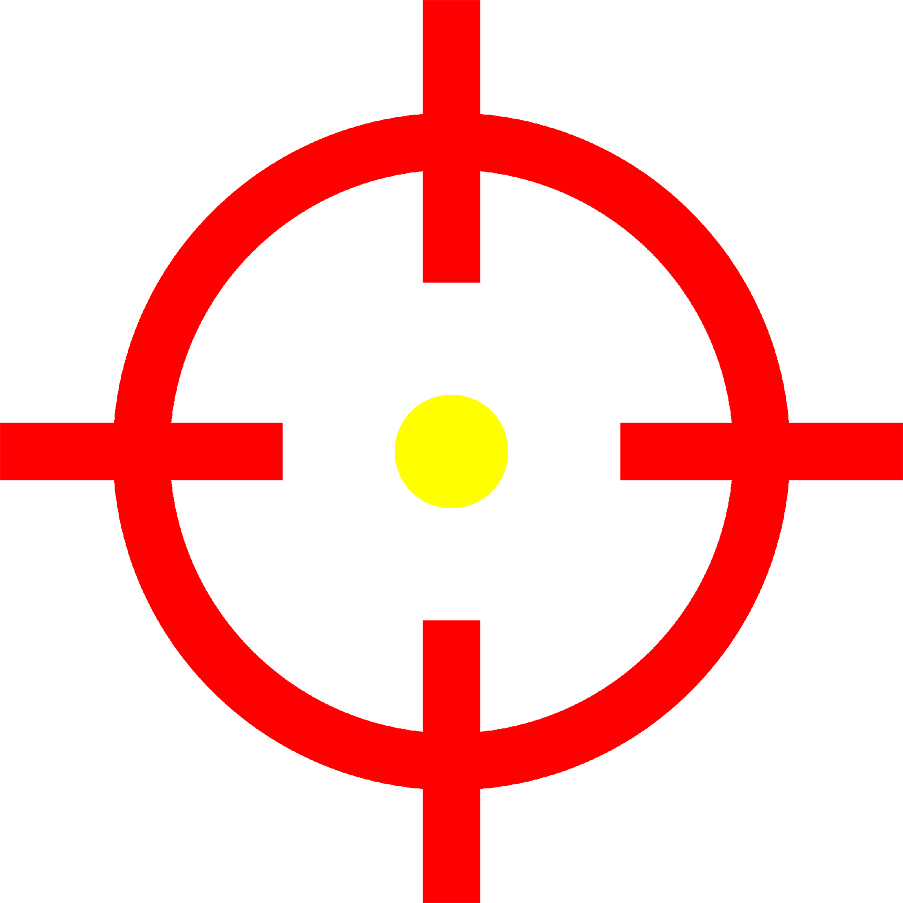

     
    
     
     
    <a href="./Pointeur.exe" target="_blank">
        <b>• Télécharger •</b>
    </a>
     
     
    
    
    
    
     
     

# Pointeur

 Copie une position du pointeur sur l'écran dans le presse papier.

## Comment ça marche ?

 Téléchargez « Pointeur.exe » sur ce [lien](./Pointeur.exe).

 Lancez Pointeur.exe puis cliquez à l'endroit souhaité. La position se mettra automatiquement dans le presse-papiers.

## License and Usage Restrictions

 This project is licensed under a custom license that **prohibits commercial use**.

 For more details, see the [LICENSE](./LICENSE) file.
